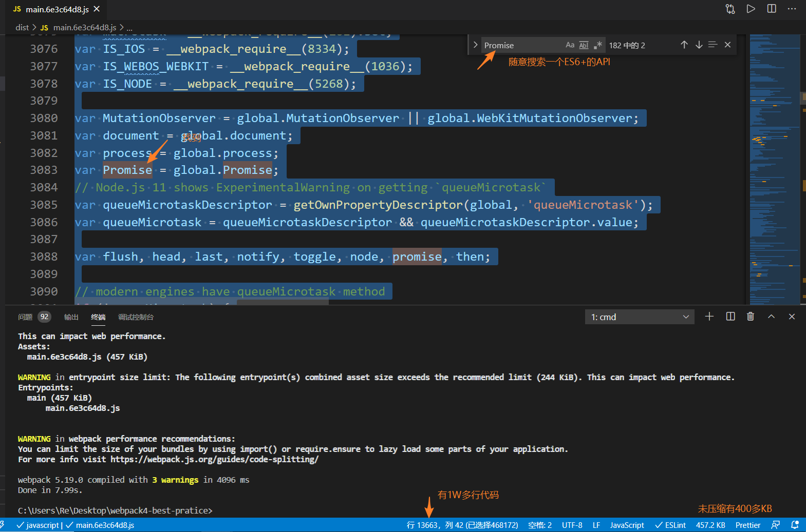
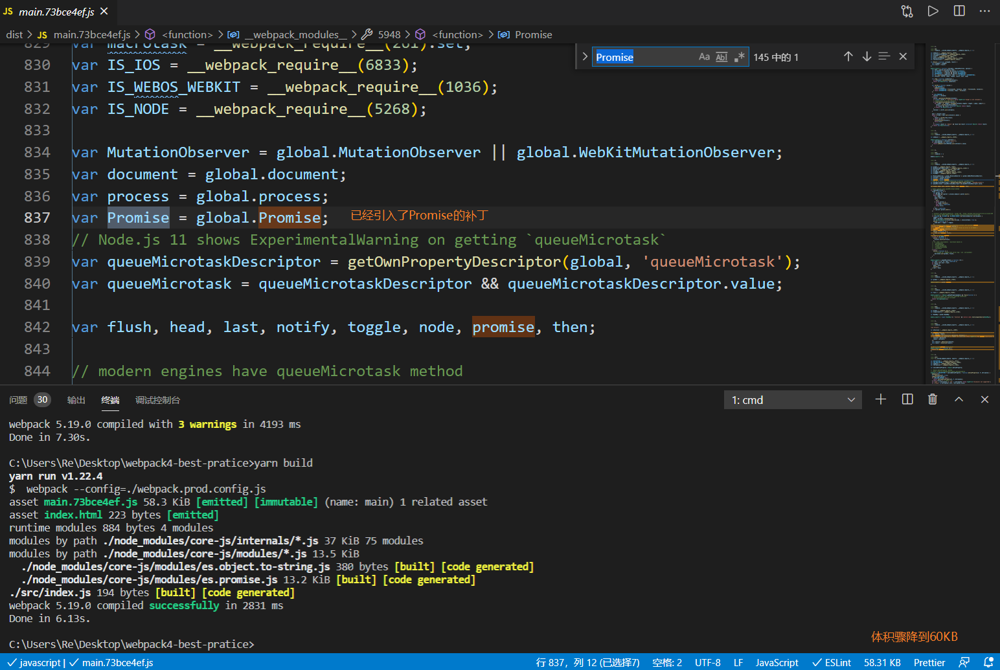
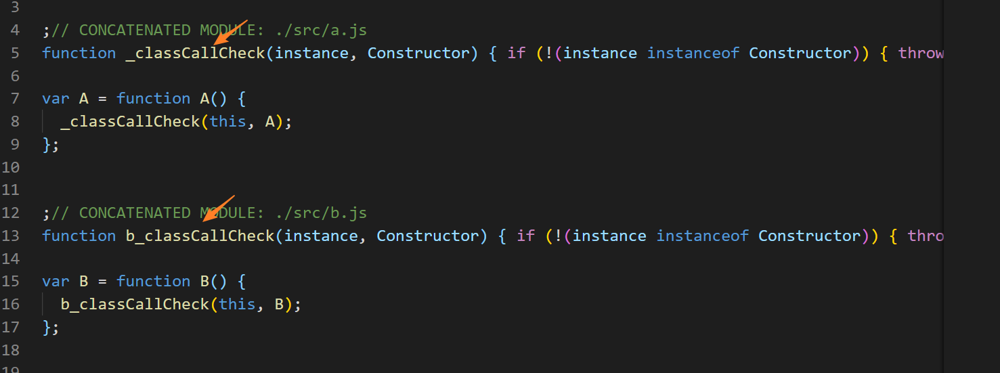
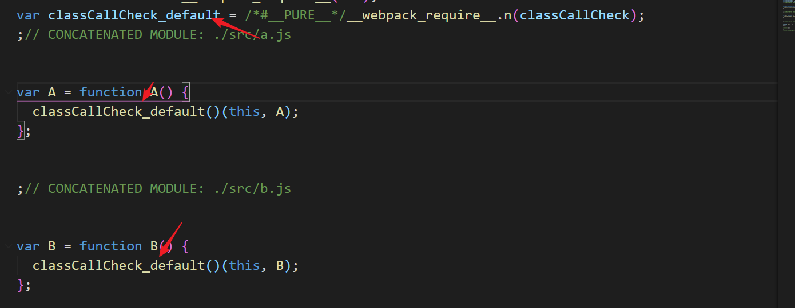
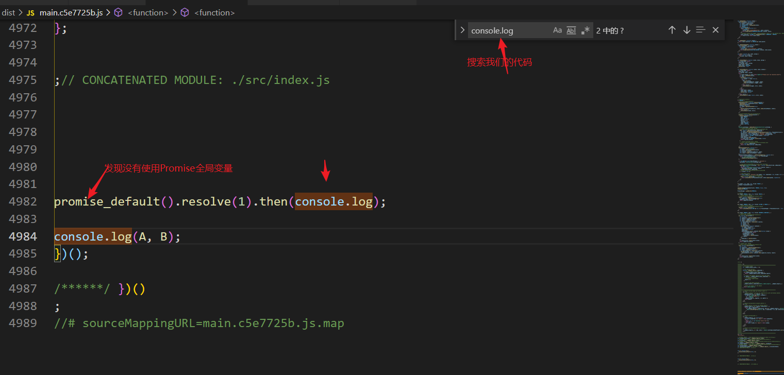
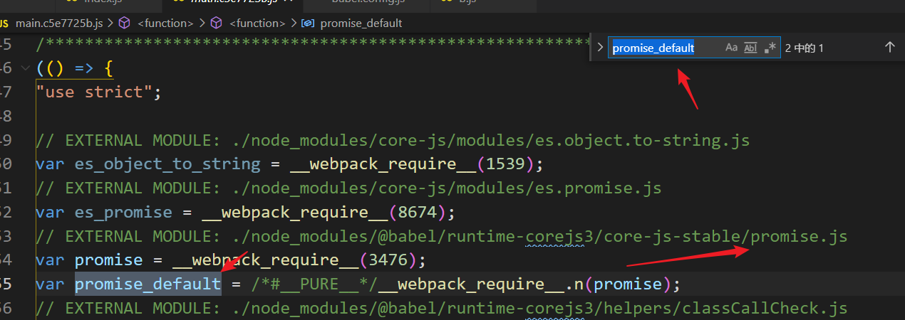
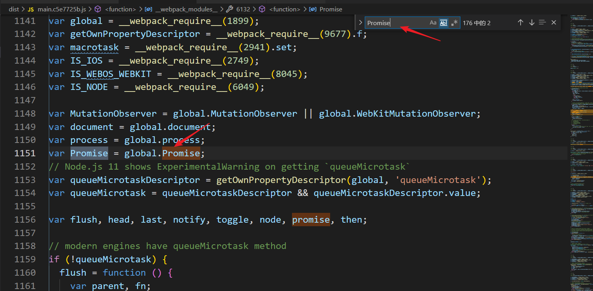

# babel的polyfill研究

目前`babel`只对语法进行转译，而`API`支持交给了`core-js`

## 语法转译

语法转译的配置非常简单

### 安装依赖

``` shell
yarn add babel-loader @babel/core @babel/preset-env
```

###  配置webpack

``` js
module.exports = {
    // 引入编译选项
    presets: [
        [
            '@babel/preset-env'
        ],
    ],
};
```

大功告成

## API支持

API支持是目前最有疑惑的，目前`API`支持分为两大类方向,一个是使用`'@babel/preset-env'`配合`usage`或者`entry`,另一个就是`@babel/plugin-transform-runtime`配置`@babel/runtime-corejs3`和`core-js@3`

### @babel/plugin-transform-runtime

[官方原话](https://www.babeljs.cn/docs/babel-plugin-transform-runtime#why)


翻译一下就是使用之前的`@babel/polyfill`会改写全局属性，导致可能在多个第三库发生问题，**`@babel/plugin-transform-runtime`就是为了不污染全局环境，所以一般用于开发库**

使用起来很简单

#### 安装依赖

``` shell 
yarn add @babel/plugin-transform-runtime
yarn add core-js@"^3"
yarn add @babel/runtime-corejs3
```

#### 配置babel.config.js

``` js
module.exports = {
    presets: [
        [
            '@babel/preset-env'
        ],
    ],
    plugins: [
        [
          "@babel/plugin-transform-runtime",
          {
            corejs: 3,
          }
        ]
    ]
};

```

### @babel/preset-env + usage or entry

`usage`和`entry`比较好理解,`entry`默认会把整个`core-js`打包进最终代码，而`usage`会分析你使用到的代码

#### @babel/preset-env + entry

**index.js**

我们在打包入口引入`core-js/stable`和`regenerator-runtime/runtime`用来代替废弃的`@babel/polyfill`

``` js
import 'core-js/stable'
import "regenerator-runtime/runtime";
```

**配置useBuiltIns为entry**

``` js
module.exports = {
    presets: [
        [
            '@babel/preset-env',{
                useBuiltIns: 'entry',
                corejs: 3,
            },
        ],
    ],
};
```

**打包结果**



可以发现我们随意搜索一个`ES6+`的`API`都能在打包后的代码中找到，同时也注意到打包未压缩前的体积非常大，聪明的工程师们就在想，**能否分析项目用到哪些API，然后按需加到最终的代码结果呢**

#### @babel/preset-env + usage

`usage` 是为了提供一种动态分析项目使用到的`API`选项，配置只是把`entry`换成`usage`,同时删除入口的`polyfill`

**index.js**

``` js
// import 'core-js/stable'
// import "regenerator-runtime/runtime";
Promise.resolve(1).then(console.log)
```

``` js
module.exports = {
    presets: [
        [
            '@babel/preset-env',{
                useBuiltIns: 'usage',
                corejs: 3,
            },
        ],
    ],
};
```

**打包结果**



重新打包后发现，我们使用的`Promise`已经引入，而且没使用到的`API`也没打包到里面，体积从400多KB降到了60KB，效果明显，**usage按需打包根据源代码中出现的语言特性自动检测需要的 polyfill。这确保了最终包里 polyfill 数量的最小化。然而，这也意味着如果其中一个依赖需要特殊的 polyfill，默认情况下 Babel 无法将其检测出来。<span style="color:red">node_modules的依赖如果依赖了一个ES6的API，然而你不知道，就会导致生产环境出现兼容性问题，使用usage其实就是将减少的体积成本转移到了开发时要对npm包的代码是否使用了ES6+的API熟悉成本</span>**

## 处理babel内联函数

### 例子

**演示代码**

`a.js`

``` js
export default class B {

}
```
`b.js`

``` js
export default class B {

}
```

`index.js`

``` js
import A from './a.js'
import B from './b.js'
// 加一个副作用，不然会被tree-shaking A和B的代码
console.log(A,B);
```

**打包结果**



每个文件`class`都有一个`_classCallCheck`，可以尝试增更多文件，可以验证<span style="color:red">助手函数在每个文件都会内联一次，增加了代码体积</span>

### @babel/plugin-transform-runtime提取内联函数

在使用`@babel/preset-env + usage or entry`的模式下，我们的助手函数会被内联在每个文件，导致代码体积无意义的增加，我在官网找到一个描述


`Babel`会使用助手函数，默认会添加到每一个文件，可以使用`@babel/plugin-transform-runtime`提取内联函数

**安装依赖**

``` shell 
yarn add @babel/plugin-transform-runtime
yarn add core-js@"^3"
yarn add @babel/runtime-corejs3
```

**配置babel.config.js**

``` js
module.exports = {
    presets: [
        [
            '@babel/preset-env',
            {
                useBuiltIns: 'usage',
                corejs: 3,
            },
        ],
    ],
    plugins: [
        [
          "@babel/plugin-transform-runtime",
          {
            corejs: 3,
          }
        ]
    ]
};

```

**打包结果**



<span style="color:red">打包之后我们发现助手函数从内联变成了从一个包引入，成功解决了内联函数在多个文件引入的问题</span>


### @babel/plugin-transform-runtime的疑问

`@babel/preset-env`加上`usage`配置`@babel/plugin-transform-runtime`确实看起来完美，在某一个查看打包后的代码，我发现了端倪：

**index.js**

``` js
Promise.resolve(1).then(console.log)
```

**打包结果**



我们找到刚才写的代码，发现`Promise`被替换成了一个`promise_default`,查找`promise_default`发现来自`runtime-corejs3`,同时发现全局也引入了一个`Promise`





<span style="color:red">@babel/plugin-transform-runtime 和 @babel/preset-env + usage都引入了Promise这个变量，造成了代码冗余</span>

### @babel/plugin-transform-runtime不能配合@babel/preset-env + usage？

因为发现输出后的代码出现`Promise`这样的冗余，我一度放弃了提起内联函数，从配置从删除`@babel/plugin-transform-runtime`,偶尔一天我去查阅`vue-cli`的源码发现使用了`@babel/plugin-transform-runtime
`
``` js
 plugins.push([require('@babel/plugin-transform-runtime'), {
    regenerator: true,
    // polyfills are injected by preset-env & polyfillsPlugin, so no need to add them again
    corejs: false,
    // 这里VueCli只在useBuiltIns为usage提取内联函数，其实无论usage和entry都可以提取函数，CRA就是这样做的
    helpers: useBuiltIns === 'usage',
    // By default, babel assumes babel/runtime version 7.0.0-beta.0,
    // explicitly resolving to match the provided helper functions.
    // https://github.com/babel/babel/issues/10261
    version: require('@babel/runtime-corejs3/package.json').version,
  }])
```

**大家看到注释都应该明白了，我们只要把`@babel/plugin-transform-runtime`的`corejs`设置为`false`就能解决API会冗余的问题了**

## 最终的babel配置

### 安装依赖

``` shell
yarn add babel-loader @babel/core @babel/preset-env
yarn add @babel/plugin-transform-runtime
yarn add core-js@"^3"
yarn add @babel/runtime-corejs3
```

### babel.config.js配置

``` js
const path = require('path')
module.exports = {
    presets: [
        [
            '@babel/preset-env',{
                // 可以entry或者usage
                useBuiltIns: 'entry',
                corejs: 3,
            },
        ],
    ],
    plugins: [
        [
          "@babel/plugin-transform-runtime",
          {
            corejs: false,
            version: require('@babel/runtime-corejs3/package.json').version,
            absoluteRuntime: path.dirname(
                require.resolve('@babel/runtime-corejs3/package.json')
            )
          }
        ]
    ]
};

```

## 参考资料

[VueCli 处理API冗余PR](https://github.com/vuejs/vue-cli/pull/3730/files)

[CRA的@babel/plugin-transform-runtime配置](https://github.com/facebook/create-react-app/blob/master/packages/babel-preset-react-app/create.js)