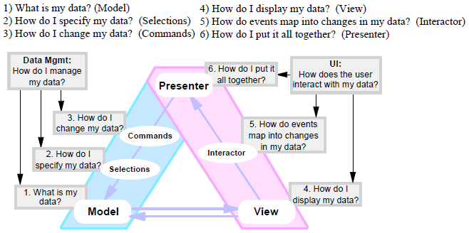
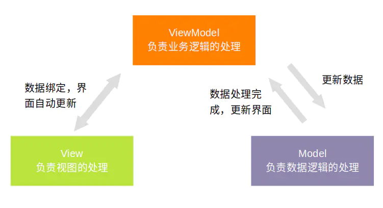

# MV*架构分析

## MVC
### MVC概念

`MVC`模式最早由`Trygve Reenskaug`在`1978`年[提出](http://heim.ifi.uio.no/~trygver/themes/mvc/mvc-index.html),[中文翻译](https://juejin.cn/post/6844903696837378061#heading-0)

### MVC想要解决的问题

在没有任何架构里面，**逻辑，数据，界面**三者混合在一起，十分难以维护，`MVC` 架构里，将**逻辑，数据，界面**的处理划分为三个部分，**模型Model-视图View-控制Controller**。各个部分的功能如下：

* `Model` 模型，负责数据的加载和存储。
* `View` 视图，负责界面的展示。
* `Controller` 控制器，负责逻辑控制。

### MVC数据流向

在论文中，**`MVC`是直接与`Controller`进行交互 然后由`Controller`来组织`View`和`Model`最终展示给用户**

## MVP

### MVP概念

`MVP`于1996年`Mike Potel`[提出](https://www.wildcrest.com/Potel/Portfolio/mvp.pdf)

### MVP想要解决的问题

与最初的`MVC`相比较，`MVP`特点就是将输入由`Controller`移到到了`View`,它将逻辑，数据，界面的处理划分为三个部分，**模型(Model)-视图(View)-控制器(Presenter)**。各个部分的功能如下：

* `Model` 模型，负责数据的加载和存储。
* `View` 视图，负责界面的展示。
* `Presenter` 控制器，负责逻辑控制。

### MVP数据流向

## MVVM

### MVVM概念

`MVVM`于`2005 `由`John Gossman`[提出](https://docs.microsoft.com/zh-cn/archive/blogs/johngossman/introduction-to-modelviewviewmodel-pattern-for-building-wpf-apps)

### MVVM想要解决的问题

`MVVM` 要解决的问题和 `MVC`，`MVP` 大同小异：控制逻辑，数据处理逻辑和界面交互耦合，并且同时能将 `MVC` 中的 `View` 和 `Model` 解耦，MVVM 架构里，将逻辑，数据，界面的处理划分为三个部分，**模型(Model)-视图(View)-逻辑(ViewModel)**。各个部分的功能如下：

* **Model 模型**，负责数据的加载和存储。
* **View 视图**，负责界面的展示。
* **ViewModel 控制器**，负责逻辑控制。

### MVVM数据流向

`View` 产生事件，自动通知给 `ViewMode`，`ViewModel` 中进行逻辑处理后，通知 `Model` 更新数据，`Model` 更新数据后，通知数据结构给 `ViewModel`，`ViewModel` 自动通知 `View` 更新界面。

###  MVVM 架构模式的优缺点

优点：

* 结构清晰，职责划分清晰
* 模块间充分解耦
* 在 MVP 的基础上，MVVM 把 View 和 ViewModel 也进行了解耦

缺点：

* Debug 困难，由于 View 和 ViewModel 解耦，导致 Debug 时难以一眼看出 View 的事件传递
* 代码复杂性增大

## 参考资料

[浅谈 MVC、MVP 和 MVVM 架构模式](http://blog.hudongdong.com/ios/459.html/comment-page-1
)