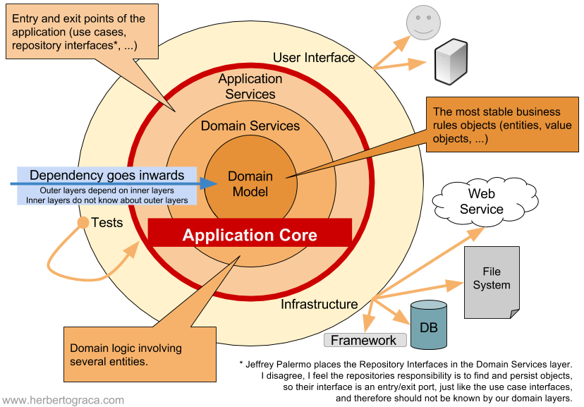

# 洋葱圈架构

## 洋葱圈架构核心思想

**洋葱架构从六边形架构发展而来，在中间的核心业务逻辑里又引入了分层**。对于洋葱架构来说，应用构建在领域模型上，**里层定义接口，外层实现接口，只能外层调用里层，里层不能调用外层，并且里层感知不到外层的存在，实现这一手段常见的是IOC和DI**，常见的分层如下：

* Domain Model：业务模型，对应DDD中的Entity、值对象等

* Domain Service：核心业务逻辑

* Application Service：应用的输入输出层

* User Interface/Tests/Application：适配器层

The onion architecture proposed by Jeffrey Palermo in 2008

## 洋葱圈架构优点

* 各层职责清晰，提高了大型复杂项目的可维护性

* 结合DDD，使项目以领域模型为主

## 洋葱圈架构缺点