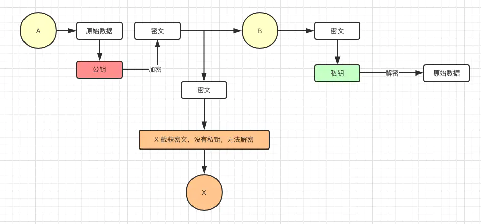

# https

## 什么是https

**https = http + tls**

`TLS`前身是`SSL`，全称**传输层安全性协议**，**也就是https会让http更加安全**

## https需要解决的问题

### 窃听

假设 `A` 正在通过互联网向 `B` 发送数据，如果不对数据进行加密，数据就可能被恶意的第三者 `X` 看到,因此保密数据需要一套加密解密机制

* 加密方式

如果加密和解用相同的密钥，称为**对称密钥加密**，但是对称密钥会被人窃听，另外有一种被称为**非对称密钥加密**的方式流程如下：

非对称加密虽然安全性非常好，但是效率不高，有一种混合加密的方式

混合加密运作方式如下：

1. 通过公开密钥加密传递密钥
2. 通过速度更快的对称密钥加密方法传递数据

### 伪造

在窃听部分，我们实现了基本的安全和效率的一个平衡，接下来面对的就是伪造这个问题：

伪造是指无法确定消息来源的完整性，可以通过`MAC`进行完成性验证解决这个问题：

### 否认

否认可以通过是数字签名，相当于只有A可以签出，解决否认问题

### 中间人攻击

`A` 拿到的其实是 `X` 发送给他的伪造公钥，但是 `A` 无法察觉,最后，`X` 用他自己的密钥加密响应数据，并发送给 `A`，就这样，虽然 `A、B` 双方能顺利完成通信，但是恶意的第三方 `X` 能看到解密后的请求数据和响应数据，而 `A、B` 双方则毫不知情

* 数字证书(CA)

通过信任数字证书的颁发机构，可以有效减少中间人攻击

**验证**

1. `CA`机构验证

2. 吊销验证`CRL`和`OCSP`

3. 篡改验证

4. 证书验证 

用秘钥加密信息摘要，同时把公钥放到证书，开放hash算法

## 总结

https在安全方面主要有以下几点组成：

1.使用对称加密和非对称加密实现安全和效率的平衡

2.使用数字签名保证数据的完整性和否认性

4.使用数字证书减少中间人攻击
