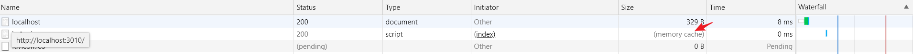

# 缓存

## 浏览器缓存机制

1. 浏览器端发起请求之后不会直接向服务器请求数据，直接先到达强缓存阶段，**如果强缓存命中直接返回，如果没有命中进入下一阶段协商缓存策略。**

2. **协商缓存是当强缓存没有命中的情况或者按下 F5 键刷新页面会触发**，它**每次都会携带标识与服务器进行校验，符合则返回 304 标识**，表示资源没有更新，如果**协商缓存也失效**了，进入下一个阶段获取最新数据，并**返回且状态码为 200**。

## 实践代码

**index.html**

```html
<html>
    <head>
        <meta charset="utf-8" />
        <title>cache-control</title>
    </head>
    <body>
        <script src="./src/index.js"></script>
    </body>
</html>
```

**index.js**

```js
const http = require('http');
const fs = require('fs');
const port = 3010;
const path = require('path')
http.createServer((request, response) => {
    console.log('request url: ', request.url);

    if (request.url === '/') {
        const html = fs.readFileSync(path.resolve(__dirname, '../index.html'), 'utf-8');
    
        response.writeHead(200, {
            'Content-Type': 'text/html',
        });

        response.end(html);
    } else if (request.url.includes('index.js')) {
        response.writeHead(200, {
            'Content-Type': 'text/javascript',
            'Expires': new Date('2020-10-15 21:31:00').toGMTString(),
        });

        response.end("console.log('script load')");
    }

}).listen(port);

console.log('server listening on port ', port);
```

### 强缓存

**Expires**

`Expires`属于`http1.0`时期产物,设置示例如下：

```js
response.writeHead(200, {
    'Content-Type': 'text/javascript',
    'Expires': new Date('2020-03-25 11:19:00'),
});
```

刷新第二次你会发现`index`会命中缓存



`Expires`的匹配规则是将`Expires`的设置时间和当前电脑时间做对比，如果`Expires`大于当前电脑时间，那么就会命中缓存,由于电脑时间不可靠，而且相对一个时间点是不友好的


**Cache-Control**

`Cache-Control `是`http1.1`产物，设置示例如下：

```js
response.writeHead(200, {
        'Content-Type': 'text/javascript',
        'Cache-Control': 'max-age=10'
    });
```

同样刷新第二次的时候，我们会看到命中缓存，`Cache-Control`的`max-age`属性是指发送请求后多少秒缓存失效，比起`Expires`基于实际时间，更容易控制

**小结**

`Expires`和`Cache-Control`都是用于强制缓存的字段，`Cache-Control`可以完全代替`Expires`,不过可以将`Expires`作为一个`Cache-Control`不兼容的回退选项

### 协商缓存

**Last-Modified/If-Modified-Since**

**测试代码**

```js
  const filePath = path.join(__dirname, './index.js'); // 拼接当前脚本文件地址
        const stat = fs.statSync(filePath); // 获取当前脚本状态
        const mtime = stat.mtime.toGMTString() // 文件的最后修改时间
        const requestMtime = request.headers['if-modified-since']; // 来自浏览器传递的值
        console.log(stat);
        console.log(mtime, requestMtime);
    
        // 走协商缓存
        if (mtime === requestMtime) {
            response.statusCode = 304;
            response.end();
            return;
        }
    
        // 协商缓存失效，重新读取数据设置 Last-Modified 响应头
        console.log('协商缓存 Last-Modified 失效');
        response.writeHead(200, {
            'Content-Type': 'text/javascript',
            'Last-Modified': mtime,
            'Cache-Control': 'max-age=0',  //设置属性清楚浏览器启发式缓存
        });
    
        const readStream = fs.createReadStream(filePath);
        readStream.pipe(response);

        response.end("console.log('script load')");
```

`Last-Modified/If-Modified-Since`其实是要认为介入，验证浏览器请求时间和文件修改时间对比，协商缓存是否生效

**ETag 和 If-None-Match**

`Etag`是根据文件的hash算法来确定是否更新文件,基本示例如下：

```js
  const filePath = path.join(__dirname, './index.js'); // 拼接当前脚本文件地址
        const buffer = fs.readFileSync(filePath); // 获取当前脚本状态
        const fileMd5 = md5(buffer); // 文件的 md5 值
        const noneMatch = request.headers['if-none-match']; // 来自浏览器端传递的值
    
        if (noneMatch === fileMd5) {
            response.statusCode = 304;
            response.end();
            return;
        }
    
        console.log('Etag 缓存失效');
        response.writeHead(200, {
            'Content-Type': 'text/javascript',
            'Cache-Control': 'max-age=0',
            'ETag': fileMd5,
        });
    
        const readStream = fs.createReadStream(filePath);
        readStream.pipe(response);
```

刷新第二次。可以看到我们的返回码是304


### CDN缓存头

x-cache

## 常见缓存技巧

* html入口不做缓存

* 资源将`Expires`和`Cache-Control`的`max-age`设置很大，通过改变资源名称来刷新资源

* 这样既能享受到缓存又能刷新资源，还不用使用md5计算大问题的计算资源

## 参考资料

[HTTP 缓存](https://developers.google.com/web/fundamentals/performance/optimizing-content-efficiency/http-caching?hl=zh-cn)

[http缓存加实践](https://github.com/qufei1993/http-protocol/blob/master/docs/http-cache.md)