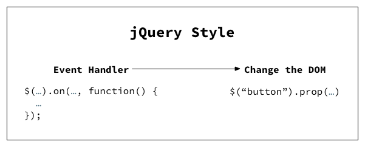
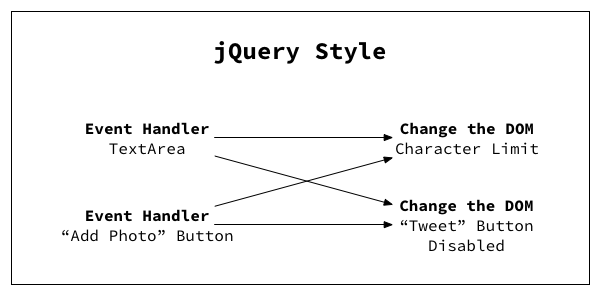
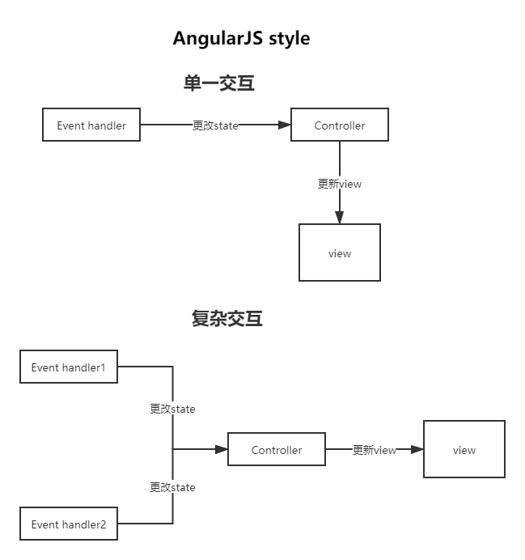
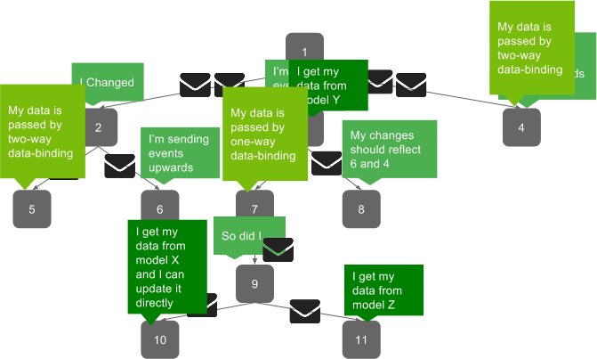
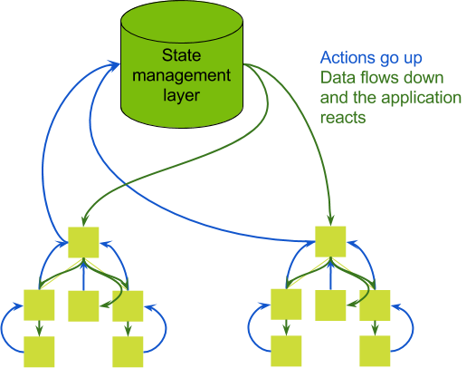
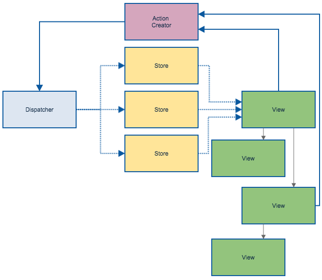

# 前端框架发展史

## 第一阶段 抹平浏览器接口差异
### 浏览器接口差异

在很长一段时间里，**浏览器的接口没有一个统一的标准进行规范，导致各个浏览器的`API`不相同**，<span style='color:red'>给开发带来了很大的负担</span>，比如现在的`W3C`,直到现在还有一些常见的兼容代码：

**绑定事件**

``` js
function addEvent(obj, type, fn, useCapTure) {
  if (obj.addEventListener) {
    obj.addEventListener(type, fn, useCapTure)
  } else {
    obj.attachEvent("on" + type, fn)
  }
}
```

**获取样式**

```js
 function getStyle(obj, attr) {
    // 非ie,google,火狐
    if (window.getComputedStyle) {
        return window.getComputedStyle(obj, null)[attr];
    }
    //ie 6 8 9
    return obj.currentStyle[attr];
 }
```

### 封装浏览器差异-jQuery

绑定时间、获取样式使用`JQuery`代码如下：

**绑定事件**

```js
// 自行处理兼容
function addEvent(obj, type, fn, useCapTure) {
  if (obj.addEventListener) {
    obj.addEventListener(type, fn, useCapTure)
  } else {
    obj.attachEvent("on" + type, fn)
  }
}

// jQuery代码
$(selector).on(type, callback)
```

**获取样式**

```js
// 自行处理兼容
function getStyle(obj, attr) {
  // 非ie,google,火狐
  if (window.getComputedStyle) {
    return window.getComputedStyle(obj, null)[attr];
  }
  //ie 6 8 9
  return obj.currentStyle[attr];
}

// jQuery代码
$(selector).css(name)
```

从`JQuery`和原生代码的实现对比来看，**开发者完全不用在写代码时，考虑特定浏览器某个API的兼容性，这是巨大的进步**

### 思考题

现在主流是三大框架，`JQuery`还有存在的必要性吗？

## 第二阶段 提升复杂交互开发效率

### 复杂交互下的开发困境

**随着`ajax`技术的发展和网页交互复杂度上升,前端视图代码复杂性也上升地很快，以表单为例常见的JQuery代码如下：**


**JQuery单一交互**

[单一状态](./jqFormSingle.html)



**JQuery交叉交互**


[复杂状态](./jqFormMutil.html.html)




在我们使用JQuery,**实现简单交互到复杂交互的对比中**，容易发现以下问题：

1. **交互复杂时，代码与视图的交互依赖已经变成了网状关系，十分不利于开发和维护**

2. 代码和视图的映射通过`DOM`的`id`甚至是结构来建立隐式联系，在开发人员维护时，难以追踪节点和代码的关系，导致错误，比如：

* 依赖了视图结构的代码，在更改视图结构时，失效

``` js
$("#infoList .info_list_item a").on('click', () => {
  // do something
})
```

``` html
<ul id="infoList">
  <li class="info_list_item">
    <a>链接名称</a>
  </li>
</ul>

<!-- 变动为下面的结构，那么上面的交互代码就失效了 -->

<ul id="infoList">
  <li class="info_list_item">
    <div>
      <a>链接名称</a>
      <span>简介</span>
    </div>
  </li>
</ul>
```

* 全局性修改节点


**正在开发的js**

``` js
$("#infoList li").on('click', function () {
  $(this).addClass('active')
})
```

**其他文件隐藏的节点操作逻辑**

``` js
$("li").on('click', function () {
  $(this).removeClass()
})
```
**其他文件隐藏的节点操作逻辑，需要打上补丁**

``` js
$("li").on('click', function () {
  if(!$(this).closest('#infoList').length) {
    $(this).removeClass()
  }
})
```

3. 代码体积容易失控，在节点操作方面，如果想要达到良好的体积，必须不断对方法进行重构，不但带来风险也带来开发效率的降低，比如下面的例子：

``` html
<div>
  <b>订单:</b>
  <div>
    数量: <input id='count' type="number"  required >
  </div>
  <div>
    单价: <input id='cost' type="number"  required >
  </div>
  <div>
    <b>总价:</b>
    <span id="allCost"></span>
    <button class="btn">支付</button>
  </div>
</div>
<script>
    const $count = $('#count')
    const $cost = $('#cost')

    function genAllCost() {
      $('#allCost').text($count.val() *  $cost.val())
    }

    $count.val('1').on('change', function () {
      genAllCost()
    })

    $cost.val('2').on('change',  function () { 
      genAllCost()
    })

    genAllCost()
  
</script>

<!-- 新增了一个现实换算后的价格逻辑 -->

<div>
  <b>订单:</b>
  <div>
    数量: <input id='count' type="number"  required >
  </div>
  <div>
    单价: <input id='cost' type="number"  required >
  </div>
  <div>
    <b>总价:</b>
    <span id="allCost"></span>
    <!-- 新增换算价格 -->
    <span id="covertCost"></span>
    <button class="btn">支付</button>
  </div>
</div>
<script>
    const $count = $('#count')
    const $cost = $('#cost')
    const $covertCost = $('#covertCost')

    function genAllCost() {
      $('#allCost').text($count.val() *  $cost.val())
      $covertCost.text(covert($count.val() *  $cost.val()))
    }
    // 当然可以重构为,但是没有约束，开发人员不一定去做
    function genAllCost() {
      const originCost = $count.val() *  $cost.val()
      $('#allCost').text(originCost)
      $covertCost.text(covert(originCost))
    }

    $count.val('1').on('change', function () {
      genAllCost()
    })

    $cost.val('2').on('change',  function () { 
      genAllCost()
    })

    genAllCost()
  
</script>
```


### 数据驱动提升交互开发效率-AngularJS

在直接操作节点部分，我们遇到了3个比较明显的问题：

1. <span style="color:red;"> 如何建立视图驱动代码与视图的显式关系</span>

2. <span style="color:red;"> 如何最大程度降低视图代码的体积</span>

3. <span style="color:red;"> 随着交互复杂度上升，如何管理代码与视图复杂的交互依赖关系</span>


`AngularJS`基于数据驱动视图的思想，**利用模板将代码和视图建立起显式的关联，而且把DOM操作的整个生命周期隐藏到框架之内，同时通过模板结合有效降低了这视图与交互不必要的代码增长**，2、3点很容易就能看到`AngularJS`解决了，这里我们重点关注第一点,**随着交互复杂度上升，如何管理代码与视图复杂的交互依赖关系**

针对以上三个问题，`AngularJS`做了一下应对措施：

<span style="color:red;">针对问题1，将视图视为模板，通过编译器来建立视图模板与驱动代码的显式对应关系</span>

<span style="color:red;">针对问题2，由于有视图模板和视图模板编译器的原因，原先关于查找、操作DOM底层的代码都被很好的复用，这部分体积在理想情况下只会是框架固定的</span>

<span style="color:red;">针对最核心的问题3，由于1、2中已经完全将DOM从代码编写从分离到框架中，得益于数据层，我们的视图与代码交互依赖变得十分清晰</span>




通过复杂交互与单一交互对比，`AngularJS`是把节点操作细节隐藏到框架内部，使得更新视图只需要更新数据即可，同时新增`Controller`管理交互代码，极大地简化了复杂交互下同步视图的交互依赖问题。

**AngularJS实现**

**index.html**

```html
<!doctype html>
<html ng-app="invoice2">
  <head>
    <script src="http://code.angularjs.org/1.2.25/angular.min.js"></script>
    <script src="finance2.js"></script>
    <script src="invoice2.js"></script>
  </head>
  <body>
    <div ng-controller="InvoiceController as invoice">
      <b>订单:</b>
      <div>
        数量: <input type="number" ng-model="invoice.qty" required >
      </div>
      <div>
        单价: <input type="number" ng-model="invoice.cost" required >
        <select ng-model="invoice.inCurr">
          <option ng-repeat="c in invoice.currencies">{{c}}</option>
        </select>
      </div>
      <div>
        <b>总价:</b>
        <span >{{invoice.total('USD')}}</span>
        <button class="btn" ng-click="invoice.pay()">支付</button>
      </div>
    </div>
  </body>
</html>
```

**invoice2.js**

```js
angular.module('invoice2', ['finance2'])
  .controller('InvoiceController', ['currencyConverter', function(currencyConverter) {
    this.qty = 1;
    this.cost = 2;
    this.inCurr = 'EUR';
    this.currencies = currencyConverter.currencies;
 
    this.total = function total(outCurr) {
      return currencyConverter.convert(this.qty * this.cost, this.inCurr, outCurr);
    };
    this.pay = function pay() {
      window.alert("谢谢！");
    };
  }]);
```

**finance2.js**

```js
angular.module('finance2', [])
  .factory('currencyConverter', function() {
    var currencies = ['USD', 'EUR', 'CNY'],
        usdToForeignRates = {
      USD: 1,
      EUR: 0.74,
      CNY: 6.09
    };
    return {
      currencies: currencies,
      convert: convert
    };
 
    function convert(amount, inCurr, outCurr) {
      return amount * usdToForeignRates[outCurr] * 1 / usdToForeignRates[inCurr];
    }
});
```

`AngularJS`主要有以下创新点；

1. 提出并实现**数据驱动视图、单页面应用**等概念

2. `MVC`架构和`Service`分层架构，使得代码清晰性和可维护性好

### 思考题

如何管理与数据驱动不适应的代码？

## 第三阶段 提升UI开发效率

### UI复用困难问题

`AngularJS`虽然通过指令可以实现现在组件一部分功能，但是支持不够，导致`UI`代码复用率很低

### UI复用方案-组件化-React

[React的创新之处](https://www.youtube.com/watch?v=XxVg_s8xAms)主要有以下几点：

* 更友好的组件化支持，和我们现在写的组件基本是一样的

```js
var SayHello = createReactClass({
  getInitialState: function() {
    return {message: 'Hello!'};
  },

  handleClick: function() {
    alert(this.state.message);
  },

  render: function() {
    return (
      <button onClick={this.handleClick}>
        Say hello
      </button>
    );
  }
});
```

* 基于`Virtual DOM` 和 渲染队列优化渲染速度

* 单向数据流，更利于理解和调试

### 思考题

组件划分的标准是什么？

## 第四阶段-声明式数据驱动

### 声明式和命令式区别

声明式描述是做什么

命令式描述具体的步骤

一个例子就是：

**命令式乘2**

``` js
var array = [1,2,3]
var output = []
for(var i = 0; i < array.length; i++) 
{
  var tmp = array[i] * 2
  output.push (tmp)
}
console.log (output) //=> [2,4,6]
```

**声明式乘2**

``` js
var array = [1,2,3,]
var output = array.map (function (n) 
{
  return n * 2
})
console.log (output) //=> [2,4,6]
```

### 声明式数据驱动框架诞生 - Vue

* 基于声明式数据驱动视图,对比React是这样的

**React更新视图**

```js
this.setState({
  a: 1
})
```

**Vue更新视图**

```js
this.a = 1
```

## 前框框架必备特性：

* 数据驱动视图 

* 组件化 

* 单页面 

* 数据状态管理 

* 跨平台方案(包括服务端渲染) 

## 数据驱动实现

### 变化侦测类型

#### push模型

而`PUSH`的响应式框架代表为`Vue`，知道哪个状态变化，可以进行细粒度的更新。

**响应式-Vue**

在`Virtual-DOM`基础上，Vue发掘了另外一条更新视图的道路，**数据劫持&观察者模式**

``` html 

<!DOCTYPE html>
<html lang="en">

<head>
    <meta charset="UTF-8">
    <title>setter</title>
    <meta name="viewport" content="width=device-width, initial-scale=1.0, user-scalable=0, minimum-scale=1.0, maximum-scale=1.0" />
</head>

<body>

<input type="text" id="input" data-bind="value">
<div id="output" data-bind="value"></div>
<button id="btn">update value</button>

<script>
var $ = document.querySelector.bind(document);
var $input = $('#input');
var $output = $('#output');

var data = {
    value: 'default text'
};


// 根据data生成cache
var cacheArr = [];
var cacheData = function(data) {
    // check cache arr
    for (var i = 0; i < cacheArr.length; i++) {
        if (cacheArr[i]._cacheSource === data) {
            return cacheArr[i];
        }
    }

    // create
    var cache = {
        _cacheSource: data
    };
    for (var k in data) {
        if (data.hasOwnProperty(k)) {
            cache[k] = data[k];
        }
    }
    cacheArr.push(cache);
    return cache;
};

var updateView = function(cache, newValue) {
    var nodes = cache._cachedNodes;
    var VALUE_NODES = ['INPUT', 'TEXTAREA'];

    nodes.forEach(function(node) {
        if (VALUE_NODES.indexOf(node.tagName) !== -1) {
            if (node.value !== newValue) {
                node.value = newValue;
            }
        }
        else {
            node.innerText = newValue;
        }
    });
};

var bind = function(node, data) {
    var key = node.getAttribute('data-bind');
    if (!key) return console.error('no data-bind key');

    // cache
    var cache = cacheData(data);

    // data to view
    if (cache._cachedNodes) {
        cache._cachedNodes.push(node);
    }
    else {
        cache._cachedNodes = [node];
        // setter: data to view
        Object.defineProperty(data, key, {
            enumerable: true,
            set: function(newValue) {
                cache[key] = newValue;
                // update view
                updateView(cache, newValue);
                return cache[key];
            },
            get: function() {
                return cache[key];
            }
        });
    }

    // init view
    updateView(cache, cache[key]);
};
bind($input, data);
bind($output, data);

// event: view to data
$input.addEventListener('input', function() {
    data[$input.getAttribute('data-bind')] = this.value;
});


// 手动改变量值
$('#btn').onclick = function() {
    data.value = 'updated value ' + Date.now();
};
</script>

</body>

</html>
```


#### pull模型

`PULL`的响应式框架代表有`Angular`和`React`，它们的特点主要是：不知道哪个状态变化了，当我收到信号后，就要进行差异“比较”。

**AngularJS-dirtyCheck**

**脏检查是检查队里中的watcher是否稳定(新旧值一样)，如果不稳定就继续从跟节点执行脏检查，直到所有的watcher稳定(新旧值一样)为止**，下面是一个简单的示例：

``` html
<!DOCTYPE html>
<html lang="en">

<head>
    <meta charset="UTF-8">
    <title>dirty checking</title>
    <meta name="viewport" content="width=device-width, initial-scale=1.0, user-scalable=0, minimum-scale=1.0, maximum-scale=1.0" />
</head>

<body>

<input type="text" id="input" data-bind="value">
<div id="output" data-bind="value"></div>
<button id="btn">update value</button>

<script>
// ref: https://ryanclark.me/how-angularjs-implements-dirty-checking/
var Scope = function() {
    this.$$watchers = [];
};

Scope.prototype.$watch = function(watchExp, listener) {
    this.$$watchers.push({
        watchExp: watchExp,
        listener: listener || function() {}
        // 之后的脏检查会添一个last属性，用来缓存oldValue
    });
};

Scope.prototype.$digest = function() {
    var dirty;

    do {
        dirty = false;

        // 遍历watcher，检查last有没有变脏
        for(var i = 0; i < this.$$watchers.length; i++) {
            // 用取值方法watchExp重新取一次值
            // 不直接记key取，更灵活些（可以在watchExp里手动包装一个新值，不关心值在谁身上）
            var newValue = this.$$watchers[i].watchExp(),
                oldValue = this.$$watchers[i].last;

            if(oldValue !== newValue) {
                // 记下的last变脏了，触发回调
                // 第一次digest时，last是undefined，所以至少会执行一次listener
                this.$$watchers[i].listener(newValue, oldValue);
                // 控制外层待会儿再检查一遍，看执行listener有没有引起别的变化
                //! 只要发现脏东西，就要再检查一遍，确保digest完毕后last和数据一致
                dirty = true;
                // 更新缓存值
                this.$$watchers[i].last = newValue;
            }
        }
    } while (dirty);
};


var $ = document.querySelector.bind(document);
var $input = $('#input');
var $output = $('#output');

var $scope = new Scope();
$scope.value = 'default value';

var updateView = function(scope, newValue) {
    var nodes = scope._nodes;
    var VALUE_NODES = ['INPUT', 'TEXTAREA'];

    nodes.forEach(function(node) {
        if (VALUE_NODES.indexOf(node.tagName) !== -1) {
            if (node.value !== newValue) {
                node.value = newValue;
            }
        }
        else {
            node.innerText = newValue;
        }
    });
};

var bind = function(scope, node) {
    scope._nodes = scope._nodes || [];
    scope._nodes.push(node);
    var key = node.getAttribute('data-bind');
    if (!key) return console.error('no data bing key');

    // init view
    updateView(scope, scope[key]);

    // data to view
    scope.$watch(function(){
        return scope[key];
    }, function(newValue, oldValue) {
        // console.log(oldValue, newValue);
        updateView(scope, newValue);
    });
};

bind($scope, $input);
bind($scope, $output);


// view to data
$input.addEventListener('input', function() {
    $scope.value = $input.value;
    $scope.$digest();
});


// 手动改变量值
$('#btn').onclick = function() {
    $scope.value = 'updated value ' + Date.now();
    $scope.$digest();
};
</script>

</body>

</html>
```

**Virtual-DOM React**

**基于操作DOM是慢的，而js运行是非常快的思想**，`React`使用了 **`Virtual-DOM`技术**，**通过在内存使用`javaScript`来对比新旧视图区别，最后将真实变动的部分更新到视图上**，下面是一个著名的`Virtual-DOM`使用案例：

``` js
// ref: https://github.com/snabbdom/snabbdom
import { init } from 'snabbdom/init'
import { classModule } from 'snabbdom/modules/class'
import { propsModule } from 'snabbdom/modules/props'
import { styleModule } from 'snabbdom/modules/style'
import { eventListenersModule } from 'snabbdom/modules/eventlisteners'
import { h } from 'snabbdom/h' // helper function for creating vnodes

var patch = init([ // Init patch function with chosen modules
  classModule, // makes it easy to toggle classes
  propsModule, // for setting properties on DOM elements
  styleModule, // handles styling on elements with support for animations
  eventListenersModule, // attaches event listeners
])

var container = document.getElementById('container')

var vnode = h('div#container.two.classes', { on: { click: someFn } }, [
  h('span', { style: { fontWeight: 'bold' } }, 'This is bold'),
  ' and this is just normal text',
  h('a', { props: { href: '/foo' } }, 'I\'ll take you places!')
])
// Patch into empty DOM element – this modifies the DOM as a side effect
patch(container, vnode)
```
### 渲染优化模型

#### Virual DOM

JIT(Just-in-time), 动态编译,其典型代表就是**React推出的Virtual-DOM**方式，在运行代码的时候进行性能优化

#### Increment DOM

AOT(Ahead Of Time)，指运行前编译，其典型代表就是**svelte和Angular ivy 引擎推出的Incremental DOM**，把对视图的操作编译成对应的函数，抛弃对比的思路，直接在框架底层操作精确节点，一个简单的编译结果如下,可以在此：

``` js
<script>
	let name = 'world';
</script>

<h1>Hello {name}!</h1>
```

``` js
/* App.svelte generated by Svelte v3.31.0 */
import {
	SvelteComponent,
	detach,
	element,
	init,
	insert,
	noop,
	safe_not_equal
} from "svelte/internal";

function create_fragment(ctx) {
	let h1;

	return {
		c() {
			h1 = element("h1");
			h1.textContent = `Hello ${name}!`;
		},
		m(target, anchor) {
			insert(target, h1, anchor);
		},
		p: noop,
		i: noop,
		o: noop,
		d(detaching) {
			if (detaching) detach(h1);
		}
	};
}

let name = "world";

class App extends SvelteComponent {
	constructor(options) {
		super();
		init(this, options, null, create_fragment, safe_not_equal, {});
	}
}

export default App;
```


## 如何管理状态

### 混乱的数据流

[2014年`FaceBook`在基于`React`实践`MVC`代码开发后](https://www.youtube.com/watch?v=nYkdrAPrdcw)，发掘到了传统`MVC`在大型项目下的不足，**现实中的程序往往是多视图，多模型。更严重的是视图与模型之间还可以是多对多的关系**，比如下图：


这带来调试和理解的困难，比如调试代码。<span style="color:red;">假设在一个复杂的`MVC`的架构中，有多个`controller`可以修改`model`，而开发时`model`的数据产出有误，则你很难判断出是哪个`controller`出的错，只能使用控制变量法进行调试</span>


### 集中式的数据仓库

先看一下没有状态管理的组件共享数据流



<span style="color:red;">毫无疑问，随着项目复杂度上升，那么整个数据流图会变成一张网，难以理解</span>

如果我们引入一个全局对象呢



<span style="color:red;">把共享状态提升到全局对象之后，我们的数据流变得清晰</span>

### 集中式仓库数据流约束

在前面我们都关注点都是难以调试和理解，那么改成全局对象，数据流是清晰容易理解了，但是调试还是复杂的，我们仍然不知道状态是谁改变了，这个时候需要一定的约束来帮助我们提升代码的可维护性




在上述的约束下，我们可以通过`Action`那边进行调试就能很好地找到数据变动源，得益于通用的数据操作流程，我们可以做到以下事情：

* devtools

* 时间旅行

最后，这里有一篇对比`MVC`和`Flux`的文章，[MVC VS Flux](./http://qingbob.com/mvc-vs-flux/)


## 逻辑复用对比

### 三大框架逻辑复用方式

* Angular rxjs + service + DI

* react hook

* vue hook

### 逻辑复用核心条件

* 驱动视图

* 封装副作用

### 面向Hook编程

https://github.com/u3u/vue-hooks
https://vueuse.js.org/functions.html


