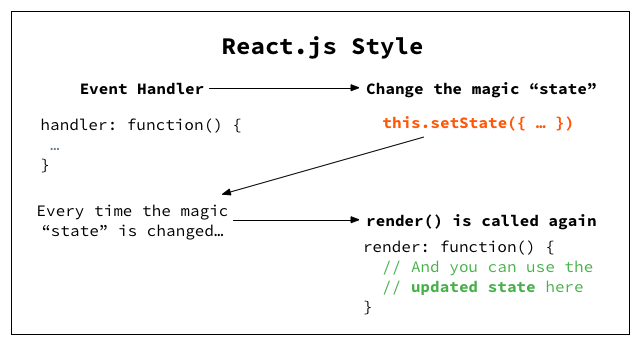
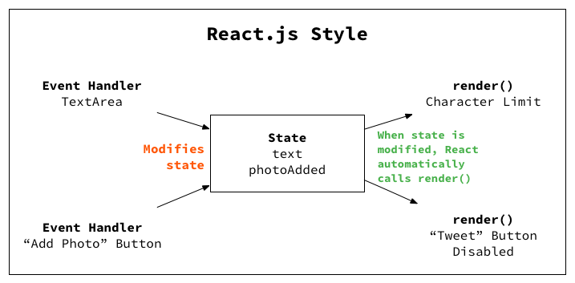

# 前端框架发展史

## 兼容性-JQuery

在`JQuery`出现之前，当时的浏览器操作`DOM`和`事件`的接口很多是不同的，遗留到现在比较常见的例子有：

**绑定事件**

```js
function addEvent(obj, type, fn, useCapTure) {
    if (obj.addEventListener) {
        obj.addEventListener(type, fn, useCapTure)
    } else {
        obj.attachEvent("on" + type, fn)
    }
}
```

**获取样式**

```js
 function getStyle(obj, attr) {
    // 非ie,google,火狐
    if (window.getComputedStyle) {
        return window.getComputedStyle(obj, null)[attr];
    }
    //ie 6 8 9
    return obj.currentStyle[attr];
 }
```

上述2个实例使用`JQuery`代码如下：

**绑定事件**

```js
$(selector).on(type, callback)
```

**获取样式**

```js
$(selector).css(name)
```

从`JQuery`和原生代码的实现来看，其代码简洁度显而易见少很多，**更重要的是开发者完全不用在写代码时，考虑特定浏览器某个API的兼容性,这是革命性的**

## 数据驱动-AngularJS

随着`ajax`技术的发展和网页交互越来越复杂，我们的前端代码不断增加，这个时候`Angular`基于常见的`MVC`架构推出了，在`Angular`诞生之前，我们的代码一般都是这样的，以`JQuery`为例：

**JQuery实现**

``` html
<!doctype html>
<html>
  <head>
    <script src="https://cdn.bootcdn.net/ajax/libs/jquery/3.5.1/jquery.js"></script>
  </head>
  <body>
    <div>
      <b>订单:</b>
      <div>
        数量: <input id='count' type="number"  required >
      </div>
      <div>
        单价: <input id='cost' type="number"  required >
      </div>
      <div>
        <b>总价:</b>
        <span id="allCost"></span>
        <button class="btn">支付</button>
      </div>
    </div>
  </body>
  <script>
      const $count = $('#count')
      const $cost = $('#cost')

      function genAllCost() {
        $('#allCost').text($count.val() *  $cost.val())
      }

      $count.val('1').on('change', function () {
        genAllCost()
      })

      $cost.val('2').on('change',  function () { 
        genAllCost()
      })
      genAllCost()
   
  </script>
</html>
```

**AngularJS实现**

**view-index.html**

```html
<!doctype html>
<html ng-app="invoice2">
  <head>
    <script src="http://code.angularjs.org/1.2.25/angular.min.js"></script>
    <script src="finance2.js"></script>
    <script src="invoice2.js"></script>
  </head>
  <body>
    <div ng-controller="InvoiceController as invoice">
      <b>订单:</b>
      <div>
        数量: <input type="number" ng-model="invoice.qty" required >
      </div>
      <div>
        单价: <input type="number" ng-model="invoice.cost" required >
        <select ng-model="invoice.inCurr">
          <option ng-repeat="c in invoice.currencies">{{c}}</option>
        </select>
      </div>
      <div>
        <b>总价:</b>
        <span >{{invoice.total('USD')}}</span>
        <button class="btn" ng-click="invoice.pay()">支付</button>
      </div>
    </div>
  </body>
</html>
```

**ctroller-invoice2.js**

```js
angular.module('invoice2', ['finance2'])
  .controller('InvoiceController', ['currencyConverter', function(currencyConverter) {
    this.qty = 1;
    this.cost = 2;
    this.inCurr = 'EUR';
    this.currencies = currencyConverter.currencies;
 
    this.total = function total(outCurr) {
      return currencyConverter.convert(this.qty * this.cost, this.inCurr, outCurr);
    };
    this.pay = function pay() {
      window.alert("谢谢！");
    };
  }]);
```

**service-finance2.js**

```js
angular.module('finance2', [])
  .factory('currencyConverter', function() {
    var currencies = ['USD', 'EUR', 'CNY'],
        usdToForeignRates = {
      USD: 1,
      EUR: 0.74,
      CNY: 6.09
    };
    return {
      currencies: currencies,
      convert: convert
    };
 
    function convert(amount, inCurr, outCurr) {
      return amount * usdToForeignRates[outCurr] * 1 / usdToForeignRates[inCurr];
    }
});
```


通过`AngularJS`与`JQuery`的对比,`AngularJS`发生了以下改变：

1. **从面向`DOM`驱动转变到了面向数据驱动**, 基于数据驱动设计的UI操作，比起基于DOM设计的UI操作更加优秀，下面展示了从简单交互到复杂交互下，`JQuery`和`AngularJS`交互依赖图：

**JQuery单一交互**


**JQuery交叉交互**


**AngularJS单一交互**



**AngularJS交叉交互**



2. **单页面应用**

```js
// 可以看到和现在前端路由没什么太大差别
projectApp.config(function($routeProvider){
  $routeProvider.
      when('/', {templateUrl: 'list.html', controller: ProjectListController}).
      when('/project/:id', {templateUrl: 'project.html', controller: ProjectDetailController}).
      otherwise('/');
});
```

3. **自定义指令，可以实现组件，但不完善**，一个指令实现组件的例子如下：

**index.html**
```html
<!doctype html>
<meta charset="utf-8"> 
<html ng-app="docsSimpleDirective">
  <head>
    <script src="http://code.angularjs.org/1.2.25/angular.min.js"></script>
    <script src="script.js"></script>
  </head>
  <body>
    <div ng-controller="Ctrl">
      <div my-customer></div>
    </div>
  </body>
</html>
```

**script.js**

```js
angular.module('docsSimpleDirective', [])
  .controller('Ctrl', function($scope) {
    $scope.customer = {
      name: 'Naomi',
      address: '1600 Amphitheatre'
    };
  })
  .directive('myCustomer', function() {
    return {
      template: '姓名: {{customer.name}} 地址: {{customer.address}}'
    };
  });
```

4. **基于`MVC`架构，每层都是单一职责，便于维护**

[这里有一个AngularJS推出时的示例](https://github.com/mhevery/ng-google-io/blob/master/app/scripts/main.js)，这里有一个AnuglarJS设计理念的演讲[Design Decisions in AngularJS](https://www.youtube.com/watch?v=HCR7i5F5L8c)

## 组件化-React

[React的创新之处](https://www.youtube.com/watch?v=XxVg_s8xAms)主要有以下几点：

* 更友好的组件化支持，和我们现在写的组件基本是一样的

```js
var SayHello = createReactClass({
  getInitialState: function() {
    return {message: 'Hello!'};
  },

  handleClick: function() {
    alert(this.state.message);
  },

  render: function() {
    return (
      <button onClick={this.handleClick}>
        Say hello
      </button>
    );
  }
});
```

* Virtual DOM 和 渲染队列优化渲染速度

## MVVM-Vue

* 基于声明式数据驱动视图,对比React是这样的

**React更新视图**

```js
this.setState({
  a: 1
})
```

**Vue更新视图**

```js
this.a = 1
```

## SEO-SSR

React-Next

Vue-Nuxt

Angular-AgularCli自带

## 前框框架需要提供的功能：

* 数据驱动视图

* 单页面

* 组件化

* 数据状态管理

* 跨平台方案(包括服务端渲染)

## 数据驱动方案对比

### AngularJS-dirtyCheck

**脏检查是检查队里中的watcher是否稳定(新旧值一样)，如果不稳定就继续从跟节点执行脏检查，直到所有的watcher稳定(新旧值一样)为止**，下面是一个简单的示例：

``` html
<!DOCTYPE html>
<html lang="en">

<head>
    <meta charset="UTF-8">
    <title>dirty checking</title>
    <meta name="viewport" content="width=device-width, initial-scale=1.0, user-scalable=0, minimum-scale=1.0, maximum-scale=1.0" />
</head>

<body>

<input type="text" id="input" data-bind="value">
<div id="output" data-bind="value"></div>
<button id="btn">update value</button>

<script>
// ref: https://ryanclark.me/how-angularjs-implements-dirty-checking/
var Scope = function() {
    this.$$watchers = [];
};

Scope.prototype.$watch = function(watchExp, listener) {
    this.$$watchers.push({
        watchExp: watchExp,
        listener: listener || function() {}
        // 之后的脏检查会添一个last属性，用来缓存oldValue
    });
};

Scope.prototype.$digest = function() {
    var dirty;

    do {
        dirty = false;

        // 遍历watcher，检查last有没有变脏
        for(var i = 0; i < this.$$watchers.length; i++) {
            // 用取值方法watchExp重新取一次值
            // 不直接记key取，更灵活些（可以在watchExp里手动包装一个新值，不关心值在谁身上）
            var newValue = this.$$watchers[i].watchExp(),
                oldValue = this.$$watchers[i].last;

            if(oldValue !== newValue) {
                // 记下的last变脏了，触发回调
                // 第一次digest时，last是undefined，所以至少会执行一次listener
                this.$$watchers[i].listener(newValue, oldValue);
                // 控制外层待会儿再检查一遍，看执行listener有没有引起别的变化
                //! 只要发现脏东西，就要再检查一遍，确保digest完毕后last和数据一致
                dirty = true;
                // 更新缓存值
                this.$$watchers[i].last = newValue;
            }
        }
    } while (dirty);
};


var $ = document.querySelector.bind(document);
var $input = $('#input');
var $output = $('#output');

var $scope = new Scope();
$scope.value = 'default value';

var updateView = function(scope, newValue) {
    var nodes = scope._nodes;
    var VALUE_NODES = ['INPUT', 'TEXTAREA'];

    nodes.forEach(function(node) {
        if (VALUE_NODES.indexOf(node.tagName) !== -1) {
            if (node.value !== newValue) {
                node.value = newValue;
            }
        }
        else {
            node.innerText = newValue;
        }
    });
};

var bind = function(scope, node) {
    scope._nodes = scope._nodes || [];
    scope._nodes.push(node);
    var key = node.getAttribute('data-bind');
    if (!key) return console.error('no data bing key');

    // init view
    updateView(scope, scope[key]);

    // data to view
    scope.$watch(function(){
        return scope[key];
    }, function(newValue, oldValue) {
        // console.log(oldValue, newValue);
        updateView(scope, newValue);
    });
};

bind($scope, $input);
bind($scope, $output);


// view to data
$input.addEventListener('input', function() {
    $scope.value = $input.value;
    $scope.$digest();
});


// 手动改变量值
$('#btn').onclick = function() {
    $scope.value = 'updated value ' + Date.now();
    $scope.$digest();
};
</script>

</body>

</html>
```

### Virtual-DOM React

**基于操作DOM是慢的，而js运行是非常快的思想**，`React`使用了 **`Virtual-DOM`技术**，**通过在内存使用`javaScript`来对比新旧视图区别，最后将真实变动的部分更新到视图上**，下面是一个著名的`Virtual-DOM`使用案例：

``` js
// ref: https://github.com/snabbdom/snabbdom
import { init } from 'snabbdom/init'
import { classModule } from 'snabbdom/modules/class'
import { propsModule } from 'snabbdom/modules/props'
import { styleModule } from 'snabbdom/modules/style'
import { eventListenersModule } from 'snabbdom/modules/eventlisteners'
import { h } from 'snabbdom/h' // helper function for creating vnodes

var patch = init([ // Init patch function with chosen modules
  classModule, // makes it easy to toggle classes
  propsModule, // for setting properties on DOM elements
  styleModule, // handles styling on elements with support for animations
  eventListenersModule, // attaches event listeners
])

var container = document.getElementById('container')

var vnode = h('div#container.two.classes', { on: { click: someFn } }, [
  h('span', { style: { fontWeight: 'bold' } }, 'This is bold'),
  ' and this is just normal text',
  h('a', { props: { href: '/foo' } }, 'I\'ll take you places!')
])
// Patch into empty DOM element – this modifies the DOM as a side effect
patch(container, vnode)
```

### 响应式-Vue

在`Virtual-DOM`基础上，Vue发掘了另外一条更新视图的道路，**数据劫持&观察者模式**

``` html 

<!DOCTYPE html>
<html lang="en">

<head>
    <meta charset="UTF-8">
    <title>setter</title>
    <meta name="viewport" content="width=device-width, initial-scale=1.0, user-scalable=0, minimum-scale=1.0, maximum-scale=1.0" />
</head>

<body>

<input type="text" id="input" data-bind="value">
<div id="output" data-bind="value"></div>
<button id="btn">update value</button>

<script>
var $ = document.querySelector.bind(document);
var $input = $('#input');
var $output = $('#output');

var data = {
    value: 'default text'
};


// 根据data生成cache
var cacheArr = [];
var cacheData = function(data) {
    // check cache arr
    for (var i = 0; i < cacheArr.length; i++) {
        if (cacheArr[i]._cacheSource === data) {
            return cacheArr[i];
        }
    }

    // create
    var cache = {
        _cacheSource: data
    };
    for (var k in data) {
        if (data.hasOwnProperty(k)) {
            cache[k] = data[k];
        }
    }
    cacheArr.push(cache);
    return cache;
};

var updateView = function(cache, newValue) {
    var nodes = cache._cachedNodes;
    var VALUE_NODES = ['INPUT', 'TEXTAREA'];

    nodes.forEach(function(node) {
        if (VALUE_NODES.indexOf(node.tagName) !== -1) {
            if (node.value !== newValue) {
                node.value = newValue;
            }
        }
        else {
            node.innerText = newValue;
        }
    });
};

var bind = function(node, data) {
    var key = node.getAttribute('data-bind');
    if (!key) return console.error('no data-bind key');

    // cache
    var cache = cacheData(data);

    // data to view
    if (cache._cachedNodes) {
        cache._cachedNodes.push(node);
    }
    else {
        cache._cachedNodes = [node];
        // setter: data to view
        Object.defineProperty(data, key, {
            enumerable: true,
            set: function(newValue) {
                cache[key] = newValue;
                // update view
                updateView(cache, newValue);
                return cache[key];
            },
            get: function() {
                return cache[key];
            }
        });
    }

    // init view
    updateView(cache, cache[key]);
};
bind($input, data);
bind($output, data);

// event: view to data
$input.addEventListener('input', function() {
    data[$input.getAttribute('data-bind')] = this.value;
});


// 手动改变量值
$('#btn').onclick = function() {
    data.value = 'updated value ' + Date.now();
};
</script>

</body>

</html>
```

### 数据驱动方案小结

目前视图更新优化有2个主要方向，**其主要方向平衡点在于双速度和内存使用**：

1. JIT(Just-in-time), 动态编译,其典型代表就是**React推出的Virtual-DOM**方式，在运行代码的时候进行性能优化

2. AOT(Ahead Of Time)，指运行前编译，其典型代表就是**svelte和Angular ivy 引擎推出的Incremental DOM**，把对视图的操作编译成对应的函数，抛弃对比的思路，直接在框架底层操作精确节点，一个简单的编译结果如下,可以在此：

``` js
<script>
	let name = 'world';
</script>

<h1>Hello {name}!</h1>
```

``` js
/* App.svelte generated by Svelte v3.31.0 */
import {
	SvelteComponent,
	detach,
	element,
	init,
	insert,
	noop,
	safe_not_equal
} from "svelte/internal";

function create_fragment(ctx) {
	let h1;

	return {
		c() {
			h1 = element("h1");
			h1.textContent = `Hello ${name}!`;
		},
		m(target, anchor) {
			insert(target, h1, anchor);
		},
		p: noop,
		i: noop,
		o: noop,
		d(detaching) {
			if (detaching) detach(h1);
		}
	};
}

let name = "world";

class App extends SvelteComponent {
	constructor(options) {
		super();
		init(this, options, null, create_fragment, safe_not_equal, {});
	}
}

export default App;
```
值得一提的是，Vue2因为单独的数据劫持加上观察者模式会带来内存上使用偏高，所以在组件级别引入了`VirtualDOM`技术

## 架构设计

`Angular`有`Controller`作为`MVC`的一层

`Vue`有`VM`作为`MVVM`的一层

`React`只是提供了`View`这层

三大框架对比下，对于实践开发，React开发要过松散，很容易写出类似jQuery那种意大利面条式的代码

## 数据状态管理对比

## 逻辑复用对比

hook  vs rxjs + service


