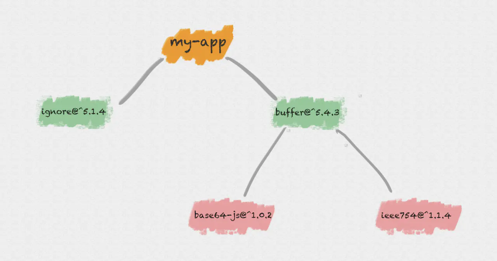
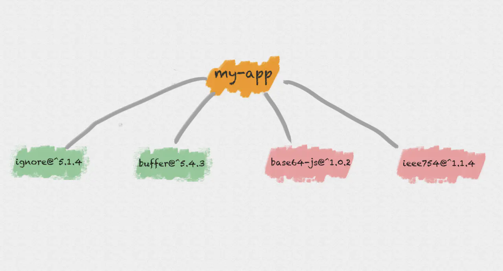
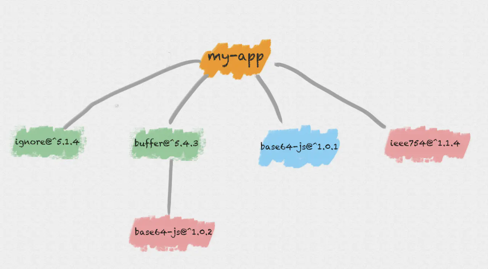

# node包管理器分析

## 依赖安装锁定

使用第三方包时，最重要的是在不同环境下，安装到的包是一致的，如果出现开发环境和生产环境包版本不一致，这是非常致命的，这也是[facebook写了yarn的原因](https://engineering.fb.com/web/yarn-a-new-package-manager-for-javascript/),简单来说他们做了两次尝试：

* 第一次，把`node_modules`全部入版本库，这使得每次人工diff花费时间非常昂贵

* 第二次把`node_modules`压缩放到云端去，但是这样不得不在在线状态开发，而且本身也要支持构建

当然当时npm有一个`shrinkwrap`机制，但是要单独执行命令，如果开发忘记执行`shrinkwrap`流程，就会导致开发环境和生产环境版本不一致,以上问题导致了`yarn`的诞生，这里我们讲`npm`在这方面的吸收，在`npm5.x`,新增了`package-lock.json`,这保证了**每次安装的模块是完全一致的**

**使用建议**

在`APP`级别上使用`package-lock.json`,而在库上，不要发布`package-lock.json`,npm发布时也会默认忽略`package-lock.json``,其目的就是为了更多复用第三方包

**注意事项**

由于`package-lock.json`机制，更改`package.json`然后执行`npm install`,此时依赖并不会更新，需要执行`npm install packageName@version` 或者`npm update`


## 依赖安全漏洞检测

第三方包质量参差不齐，如果及时发现这些包的漏洞是一个问题，`npm6.x`提供了`npm audit`命令，一般修复过程如下：

* 执行npm audit审查包的安全漏洞 

* 执行 npm audit fix 升级对应的兼容依赖

* 如果此次漏洞是不兼容的，需要执行`npm audit fix --force`


## 依赖安装规则

在早期版本，npm安装依赖是严格按照`package.json` 结构以及子依赖包的 `package.json` 结构将依赖安装到他们各自的 `node_modules` 中。直到有子依赖包不在依赖其他模块。
 

举个例子，我们的模块 my-app 现在依赖了两个模块：`buffer`、`ignore`：

```js
{
  "name": "my-app",
  "dependencies": {
    "buffer": "^5.4.3",
    "ignore": "^5.1.4",
  }
}
```
`ignore`是一个纯 `JS` 模块，不依赖任何其他模块，而`buffer`又依赖了下面两个模块：`base64-js` 、 `ieee754`。

```js
{
  "name": "buffer",


"dependencies": {
    "base64-js": "^1.0.2",
    "ieee754": "^1.1.4"
  }
}
```



这种方式非常直观，与`package.json`中的树结构是**一一对应**的，但是带来了以下问题：

* 在 `Windows` 系统中，文件路径最大长度为260个字符，**嵌套层级过深可能导致不可预知的问题**

* 一些模块可能被重复安装好几次

嵌套过深导致触发window限制的问题急需解决，同期也有了更加受欢迎的`yarn`,于是`npm3`提出了使用扁平化结构规则，同样是上面的依赖，在`npm3`安装是这样的



我们现在安装一个同名但是版本不同的模块`base64-js@1.0.1`的包，此时的结构如下



`npm3`安装依赖时，如果检测到已经有了同名的包，如果版本不同，那么就会将这个包安装到依赖他的`node_modules`目录下

这样的安装规则有一个问题，就是如果安装了2个同时依赖一个包的依赖，那么其共同依赖的版本是由安装顺序决定的

## 依赖安装速度优化策略

工程上优化速度少不了`并行`、`缓存`等策略，包管理器也是一样

### 缓存

`npm5.x`使用了新的缓存系统，用户只需要在必要的时候执行缓存清除即可`npm cache clean --force`

### 并行

npm支持了并行安装

### 离线安装

npm 提供了一下安装策略

* `--prefer-offline`,优先使用缓存数据

* `--prefer-online`,优先使用网络数据

* `--offline`,只使用本地数据    

## 常见包管理器

* pnpm，采用软链方式加速依赖安装

* cnpm，采用软链方式加速依赖安装，但是会忽略`package-lock.json`

* yarn, npm的强劲对手，npm有很多特性都是从yarn吸收的

## 推荐使用

目前只推荐使用`npm`或者`yarn`,`cnpm`和`pnpm`虽然使用软链的方式安装很快，但是同时也带来了很多问题，从github仓库来看，维护也不好


## 参考资料

[facebook写了yarn的原因](https://engineering.fb.com/web/yarn-a-new-package-manager-for-javascript/)


[为什么使用pnpm](https://www.kochan.io/nodejs/why-should-we-use-pnpm.html)
