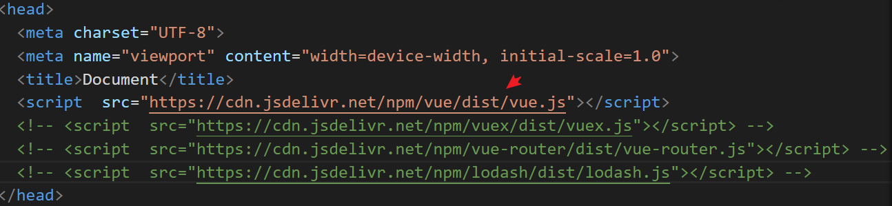
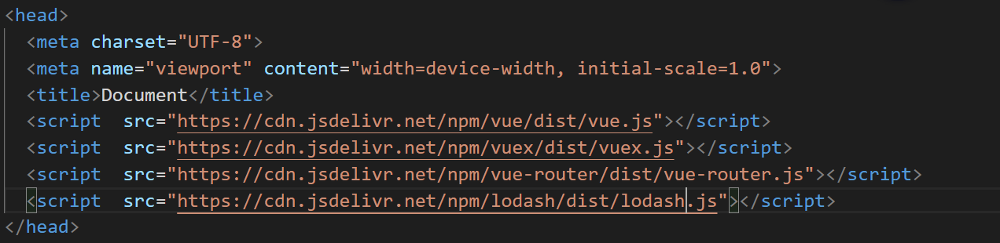

# 背景

`webpack5`在发布之时，推出了一个重大的更新`Module Federation`,**其解决的痛点主要是跨项目代码复用**

## 现阶段多项目代码共享方案

### npm 包


`npm`组织形式主要有以下痛点：

* **每个项目都要单独编译，项目的编译时长会随着引用的共享包数据增加**

* **每个项目都要单独发布，发布时长也会大量增加**

### UMD + Externals

**使用`UMD`+`Externals`方式能够避免`npm`共享方案中项目编译慢和项目发布慢的问题**，其主要的问题是`UMD`的包随着项目引用共享代码数量增加，导致了一些维护问题:

* **`external` 需要自行在 `html` 引入相关 `script`**，此方案只需引一个 `runtime` 文件，`runtime` 里维护了 `chunk` 的映射表，比如：




* **`external` 需要自行处理库的依赖关系**，比如 `antd` 依赖 `moment`，那么就需要分别引 `moment` 和 `antd` 的 `umd` 文件，并且保证顺序




* **`external` 没法拆包**，比如 `antd` 只能引一个大的 `antd`，此方案可以拆，比如只用了 `Button`，可以不引整个 `antd`

## Module Federation
###  Module Federation优点

* 共享代码更新时，使用共享代码的项目无需编译和发布

* 使用共享代码能够做到更友好的体积优化，同时依赖关系也可以自动化关系

###  Module Federation缺点

* 体积减少同时，请求数增加了

* 依赖都是运行时加载的

## 使用场景

* 跨项目代码共享

* 依赖外置化，提升编译速度

## 实践

``` ts
declare interface ModuleFederationPluginOptions {
	/**
     * 暴露的文件入口
	 */
	exposes?: (string | ExposesObject)[] | ExposesObject;

	/**
     * 暴露的runtime文件名称
	 */
	filename?: string;

	/**
	 * Options for library.
	 */
	library?: LibraryOptions;

	/**
	 * 容器名称，唯一
	 */
	name?: string;

	/**
	 * 远程容器类型
	 */
	remoteType?:
		| "var"
		| "module"
		| "assign"
		| "this"
		| "window"
		| "self"
		| "global"
		| "commonjs"
		| "commonjs2"
		| "commonjs-module"
		| "amd"
		| "amd-require"
		| "umd"
		| "umd2"
		| "jsonp"
		| "system"
		| "promise"
		| "import"
		| "script";

	/**
	 * 使用的远程模块
	 */
	remotes?: (string | RemotesObject)[] | RemotesObject;

	/**
	 * Share scope name used for all shared modules (defaults to 'default').
	 */
	shareScope?: string;

	/**
	 * 共享模块
	 */
	shared?: (string | SharedObject)[] | SharedObject;
}
```

``` ts
declare interface SharedConfig {
	/**
	 * Include the provided and fallback module directly instead behind an async request. This allows to use this shared module in initial load too. All possible shared modules need to be eager too.
	 */
	eager?: boolean;

	/**
	 * Provided module that should be provided to share scope. Also acts as fallback module if no shared module is found in share scope or version isn't valid. Defaults to the property name.
	 */
	import?: string | false;

	/**
	 * Package name to determine required version from description file. This is only needed when package name can't be automatically determined from request.
	 */
	packageName?: string;

	/**
	 * Version requirement from module in share scope.
	 */
	requiredVersion?: string | false;

	/**
	 * Module is looked up under this key from the share scope.
	 */
	shareKey?: string;

	/**
	 * Share scope name.
	 */
	shareScope?: string;

	/**
	 *只允许加载一个依赖一个版本，默认禁止
	 */
	singleton?: boolean;

	/**
	 * Do not accept shared module if version is not valid (defaults to yes, if local fallback module is available and shared module is not a singleton, otherwise no, has no effect if there is no required version specified).
	 */
	strictVersion?: boolean;

	/**
	 * 匹配兼容版本
	 */
	version?: string | false;
}
```

``` ts
declare interface ExposesConfig {
	/**
	 * 暴露的模块位置
	 */
	import: string | string[];

	/**
	 * chunk文件名称
	 */
	name?: string;
}
```


``` ts
declare interface RemotesConfig {
	/**
	 * Container locations from which modules should be resolved and loaded at runtime.
	 */
	external: string | string[];

	/**
	 * The name of the share scope shared with this remote.
	 */
	shareScope?: string;
}
```


## 目前国内应用

`emp.js`

## 参考资料

[精读 Webpack5 新特性 - 模块联邦](https://zhuanlan.zhihu.com/p/115403616)

[调研 Federated Modules，应用秒开，应用集方案，微前端加载方案改进等](https://mp.weixin.qq.com/s/sdIVsfmRlhDtT6DF2dmsJQ)

[探索 webpack5 新特性 Module federation 在腾讯文](http://www.alloyteam.com/2020/04/14338/)


[探索webpack4与webpack5多项目公共代码复用架构](https://juejin.cn/post/6844904149746745357#heading-0)

[Webpack 5 Module Federation: A game-changer in JavaScript architecture](https://indepth.dev/posts/1173/webpack-5-module-federation-a-game-changer-in-javascript-architecture#module-federation-allows-a-javascript-application-to-dynamically-run-code-from-another-bundle/build,-on-both-client-and-server.)

[module-federation-examples](https://github.com/module-federation/module-federation-examples)


