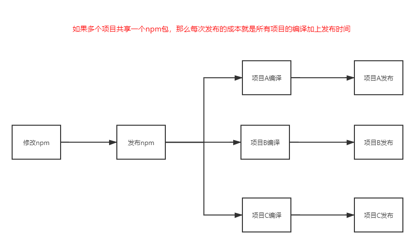

# 背景

`webpack5`在发布之时，推出了一个重大的更新`Module Federation`,**其解决的痛点主要是跨项目代码复用**

## 现阶段多项目代码共享方案

### npm 包

`npm`组织形式主要有以下痛点：

* **每个项目都要单独编译，项目的时长会随着引用的共享包数据增加**

* **每个项目都要单独发布，发布时长也会大量增加**

### UMD + Externals

使用`UMD`+`Externals`方式能够避免项目编译和项目发布的问题，但是没法对共享包进行拆分，比如 `antd` 只能引一个大的 `antd`，此方案可以拆

## Module Federation

`Module Federation`主要提供了以下优点：

* 共享代码更新时，使用共享代码的项目无需编译和发布

* 使用共享代码能够做到更友好的体积优化

## Module Federation 只是一个更小的UMD?

从前面的对比很容易看出，`Module Federation`可以理解为一个可以拆分的`UMD`方案，那么我们手动拆分`UMD`不就行了，比起`UMD`,`Module Federation`有以下好处:

* `external` 需要自行在 `html` 引入相关 `script`，此方案只需引一个 `runtime` 文件，`runtime` 里维护了 `chunk` 的映射表

* `external` 需要自行处理库的依赖，比如 `antd` 依赖 `moment`，那么就需要分别引 `moment` 和 `antd` 的 `umd` 文件，并且保证顺序

* `external` 没法拆包，比如 `antd` 只能引一个大的 `antd`，此方案可以拆，比如只用了 `Button`，可以不引整个 `antd`

## 使用场景

* 代码共享

* 依赖外置化，提升编译速度

## 目前国内应用

emp.js

## 参考资料

[精读 Webpack5 新特性 - 模块联邦](https://zhuanlan.zhihu.com/p/115403616)

[调研 Federated Modules，应用秒开，应用集方案，微前端加载方案改进等](https://mp.weixin.qq.com/s/sdIVsfmRlhDtT6DF2dmsJQ)

[探索 webpack5 新特性 Module federation 在腾讯文](http://www.alloyteam.com/2020/04/14338/)

[探索webpack4与webpack5多项目公共代码复用架构](https://juejin.cn/post/6844904149746745357#heading-0)

[Webpack 5 Module Federation: A game-changer in JavaScript architecture](https://indepth.dev/posts/1173/webpack-5-module-federation-a-game-changer-in-javascript-architecture#module-federation-allows-a-javascript-application-to-dynamically-run-code-from-another-bundle/build,-on-both-client-and-server.)

[module-federation-examples](https://github.com/module-federation/module-federation-examples)

