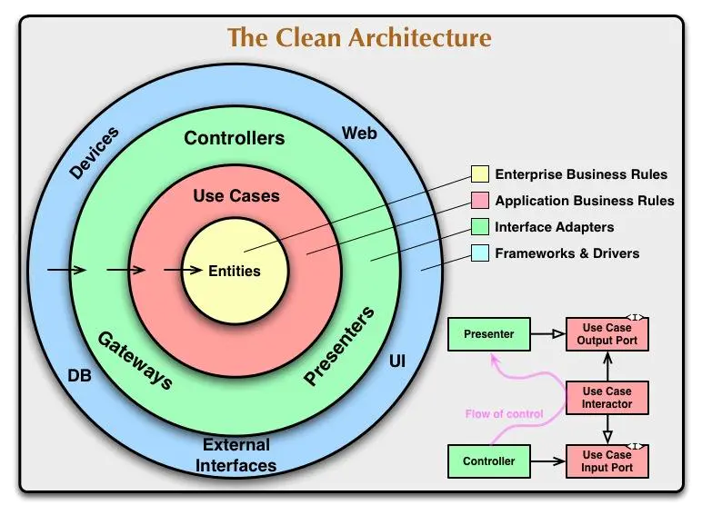

# 整洁架构

## 整洁架构核心思想

[clean architecture proposed by `Robert C. Martin` in 2012](https://www.youtube.com/watch?v=Nltqi7ODZTM) 

## 整洁架构优点

## 整洁架构缺点

## 参考文章

[The Clean Code Blog](https://blog.cleancoder.com/uncle-bob/2012/08/13/the-clean-architecture.html)

[整洁架构分析](https://www.jianshu.com/p/b565f0c00c0c)