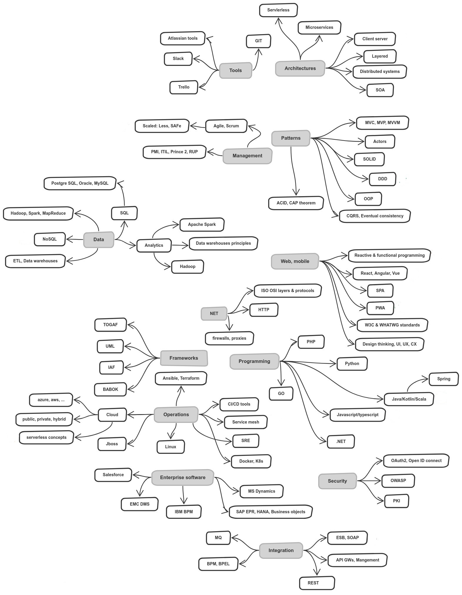

# 架构师

## 架构师是什么

软件架构师是一名**软件开发专家**，他可以**进行高层设计选择并决定技术标准**，包括软件编码标准，工具和平台。` 维基百科:软件架构师`

## 架构师的典型工作

* 理解业务，做出架构决策

* 检查和评审架构

* 技术选型

* 设计开发流程，编码标准、工具、评审过程、测试方法

* 细化设计

* 开发指导

## 架构师需要的能力

基于架构师的工作内容，可以得出以下能力：

### 设计能力

* 了解基本的设计模式

* 深耕模式和反模式

* 分析和理解应用模式，例如分析当前流行的框架设计

* 尝试不同的技术栈

### 化繁为简的能力

* 尝试从不同角度评估方案

* 分而治之

* 重构不是坏事，在没有更好的主意以前，可以先从复杂的方案开始

### 平衡能力

**质量是有代价的**：早些时候我谈到了质量和非功能性需求。如果过度使用架构，将会增加成本，并可能降低开发速度。你需要**平衡架构和功能需求**。应避免过度设计。

**解决矛盾目标：**

矛盾目标的典型例子是短期和长期目标。项目往往倾向于构建最简单的解决方案，而架构师考虑的是长期的远景。通常，简单的解决方案不适合长期的解决方案，并且有可能在以后被丢弃（沉没成本）。为了避免实施方向错误，需要考虑两件事:

1. 开发人员和业务部门需要了解长期愿景及其好处，以便调整其解决方案。
2. 负责预算的经理需要参与进来，以了解财务影响。不一定要把100%的长远眼光直接放在适当的位置，但开发出来的成本大体在预算范围内。

### 编码能力

* 尝试在技术在一个辅助项目去实践，增加对实际方案的了解度

### 评估能力

了解基本项目管理原则，给出一定的资源预测

评估“未知”架构：

1. 设计实践: 架构遵循哪些模式？它们是否得到正确使用？设计是否遵循红线或是否存在不受控制的增长？是否有明确的结构和关注点的分离？
2. 开发实践: 制定并遵守规范指南？代码的版本是怎样的？部署实践？
3. 质量保证: 测试自动化覆盖范围？静态代码分析到位且效果良好？同行评议到位？
4. 安全性: 有哪些安全概念？内置安全？渗透测试或自动安全分析工具到位并定期使用？

## 技能树

## 参考文章

[软件架构师之路](https://juejin.im/post/6844904052648574983#heading-13)

